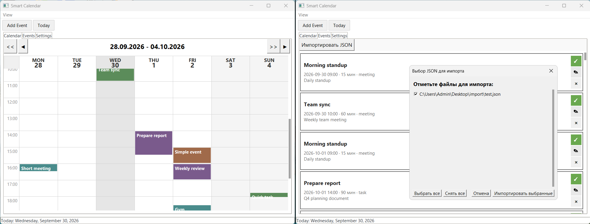

# Smart Calendar

Портативный календарь на Python + tkinter с опциональным оформлением ttkbootstrap.
Работает полностью офлайн, данные хранит локально в JSON.

Portable calendar built with Python + tkinter, with optional ttkbootstrap styling.
Runs fully offline and keeps all data in local JSON files.

---

## Содержание / Contents

- [Возможности](#возможности--features)
- [Запуск](#запуск--running)
- [Сборка](#сборка--building)
- [Структура данных](#структура-данных--data-layout)
- [Формат JSON](#формат-json--json-format)
- [Скриншот](#скриншот--screenshot)
- [Релиз v0.1.0](#релиз-v010--release-v010)
- [Лицензия](#лицензия--license)

---

## Возможности / Features

- Недельный вид с часовой сеткой, навигация по неделям (`◀ ▶`) и месяцам (`<< >>`).  
  Weekly view with hourly grid; `◀ ▶` move by week, `<< >>` by month.
- Возврат в тот же день при `<<` → `>>` (предпочтительный день месяца сохраняется).  
  `<<` then `>>` returns to the same day (preferred day-of-month preserved).
- Импорт событий из JSON — из корня проекта и из папки `import/`.  
  Import events from JSON — project root and `import/` folder.
- Лента предстоящих событий с быстрыми действиями (complete / edit / delete).  
  Upcoming events feed with quick actions (complete / edit / delete).
- Повторяющиеся события: daily / weekly / monthly / yearly.  
  Recurring events: daily / weekly / monthly / yearly.
- Откат последнего импорта через `db.back.json`.  
  One-click rollback of the last import via `db.back.json`.
- Портативность: все данные и настройки рядом с приложением.  
  Portable: all data and settings live next to the application.
- Один код для Windows, Linux и macOS.  
  Same code for Windows, Linux, and macOS.
- Работает на чистом tkinter; ttkbootstrap — опционально.  
  Runs on plain tkinter; ttkbootstrap is optional.

---

## Запуск / Running

Рекомендуемый способ — лаунчер: создаст `.venv`, предложит поставить ttkbootstrap, запустит приложение.

```bash
python _run.py
```

Быстрый запуск для разработчика (без создания `.venv`):

```bash
python main.py
```

---

## Сборка / Building

PyInstaller не поддерживает кросс-компиляцию — собирать нужно на целевой ОС.

```bash
python _build.py
```

Результат — в `dist/` (`SmartCalendar.exe` на Windows, `SmartCalendar` на Linux, `SmartCalendar.app` на macOS).

---

## Структура данных / Data layout

```
import/
  db.json         — основная база событий
  db.back.json    — резервная копия (создаётся перед импортом)
  db.tmp.json     — служебный файл при swap
```

Все данные лежат рядом с `main.py` (или рядом с `.exe` в собранной версии).

---

## Формат JSON / JSON format

Полная схема полей — в [JSON_DOCS.md](JSON_DOCS.md).
Готовый пример для теста — [import/test.json](import/test.json).

---

## Скриншот / Screenshot



На скриншоте: главное окно приложения, вкладка событий и вкладка настроек.  
The screenshot shows the main window, the events tab, and the settings tab.

---

## Релиз v0.1.0 / Release v0.1.0

Первый публичный релиз.

### Highlights

- Недельный вид с часовой сеткой и навигацией по неделям и месяцам.
- Импорт JSON вручную и автоматически при старте; один backup на партию.
- Откат последнего импорта через кнопку в **Settings**.
- Повторяющиеся события: daily / weekly / monthly / yearly.
- Портативная раскладка: `import/db.json` рядом с приложением.
- Иконка окна 512×512 PNG (fallback на `.ico`).
- Работает на чистом tkinter; ttkbootstrap — опционально.

### Запуск / Running

```bash
python _run.py
```

### Сборка / Building

```bash
python _build.py
```

### Известные ограничения / Known limitations

- Иконка `.exe` / `.app` зависит от качества исходного `calendar.ico` / `calendar.icns`.
- Персистентность настроек (`settings.json`) появится в следующем релизе.
- Экспорт в ICS пока не реализован; маппинг полей уже описан в `JSON_DOCS.md`.

---

## Лицензия / License

См. файл [LICENSE](LICENSE).
